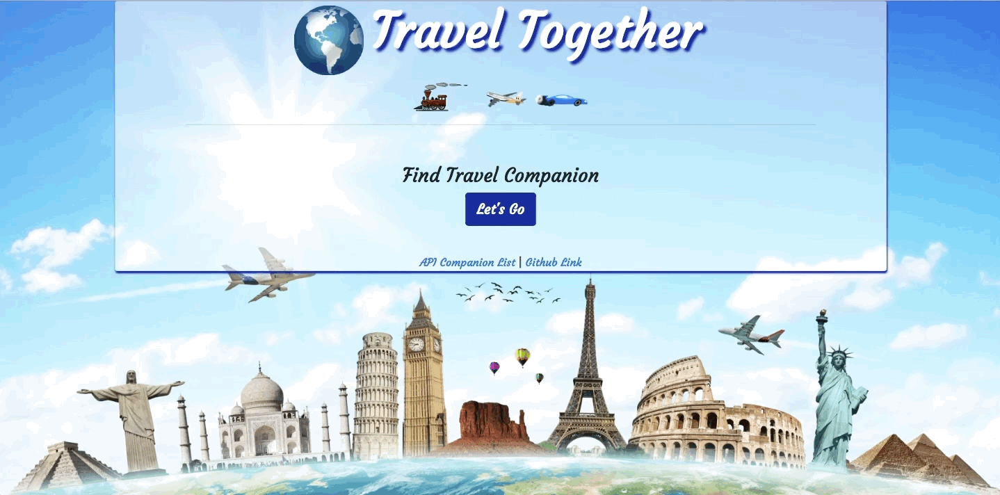
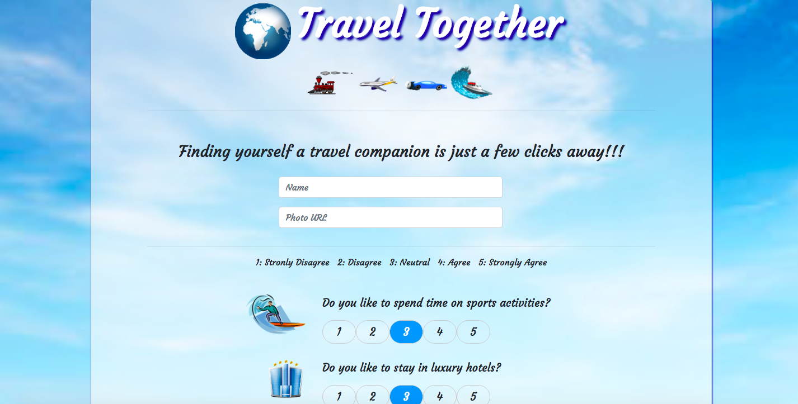
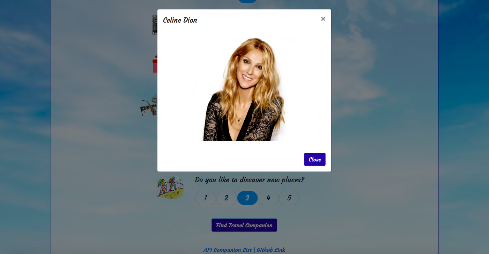
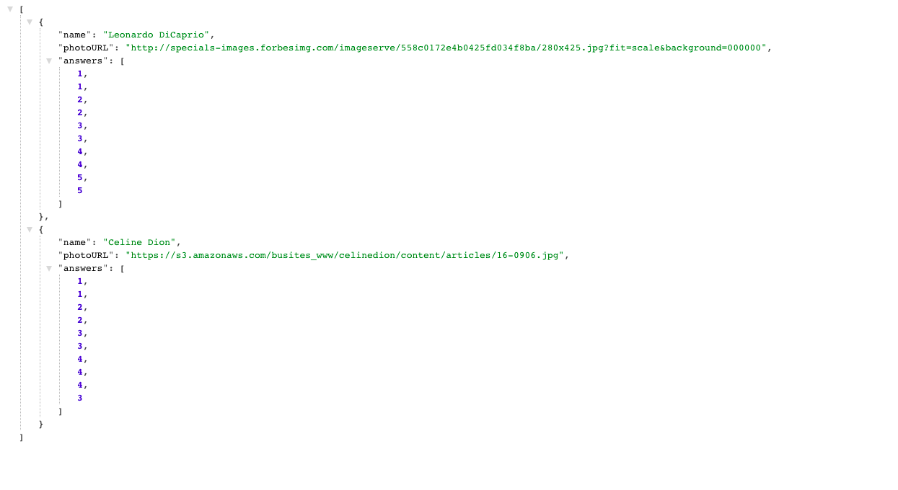

# TravelTogether

## About
TravelTogether is an node.js and express full-stack web application that lets the user take a survey and finds a travel companion for them whose survey answers are closest match with the user's.

## Application Preview

### Home Page


### Survey Page


### Survey Result


### API Data



## Technologies used
1. Node.js
2. Express

## API Data
```
[
    {
      name: "Leonardo DiCaprio",
      photoURL:"http://specials-images.forbesimg.com/imageserve/558c0172e4b0425fd034f8ba/280x425.jpg?fit=scale&background=000000",
      answers:[1,1,2,2,3,3,4,4,5,5]
    },
    {
        name: "Celine Dion",
        photoURL:"https://s3.amazonaws.com/busites_www/celinedion/content/articles/16-0906.jpg",
        answers:[1,1,2,2,3,3,4,4,4,3]
    }
];
```
API Data is an object array wherein each object consists of a name, photoURL and an array containing answers to the survey questions. It can be further utilized by querying on a person's name and getting back their answers/preferences.

## Node Packages used
1. express
    * usage
    ```require("express")```
    * It is a fast, unopinionated, minimalist web framework for node.
    * For more information: [express](https://expressjs.com)

2. path
    * usage
    ```require("path")```
    * Comes with node. The path module provides utilities for working with file and directory paths.
    * For more information: [path](https://nodejs.org/api/path.html)

3. body-parser
    * usage
    ```require("body-parser")```
    * Node.js body parsing middleware.Parses incoming request bodies in a middleware before handlers, available under the req.body property.
    * For more information: [body-parser](https://www.npmjs.com/package/body-parser)

## Execution steps on local machine
1. Make sure node is installed on your machine. You can visit the website [Node Installation](http://blog.teamtreehouse.com/install-node-js-npm-mac) for instructions.
2. Download/Clone the respository.
3. On terminal, go inside TravelTogether folder and type npm install. This will install all the dependencies required to run the application mentioned in package.json.
4. Inside TravelTogether folder on terminal, type "node server.js" on terminal. This will start the server.
5. Open the browser and type "localhost:8080". This will start executing the client part of the application. Since we are not storing the data in any database, the data user enters will only be available till the server is running (when user exits the server execution from terminal).

## Code snippets


## Learning points
1. Creating a full stack web application.
2. Learning how the server and client interact with requests and responses.
3. How the to create a server and how it starts listening for the clients' requests on a particular port.
4. Various types of ajax client requests i.e post,get,put,delete.
5. Sending various types of responses to clients including serving an html page or sending back data as json object.
6. How to query on custom API data using a placeholder /:placeholder or using query parameters ?name=Mike


## Author 
* [Ajita Srivastava Github](https://github.com/ajitas)
* [Ajita Srivastava Portfolio](https://ajitas.github.io/Portfolio/)

## License
Standard MIT License


